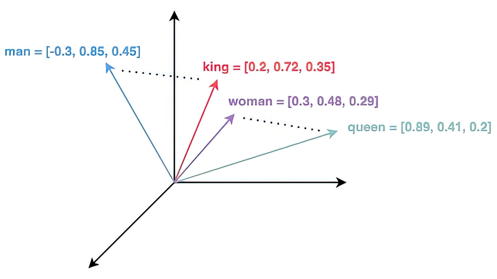
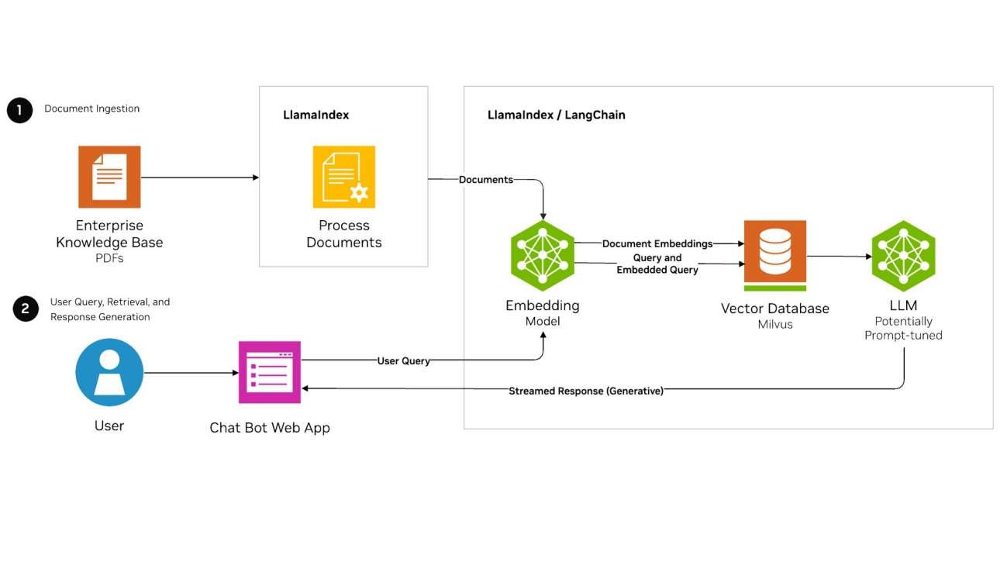
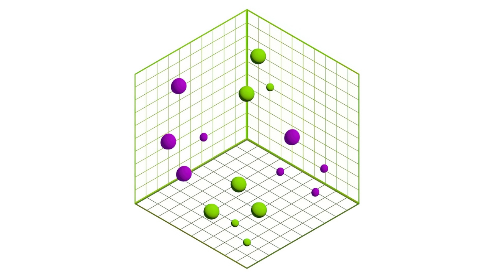
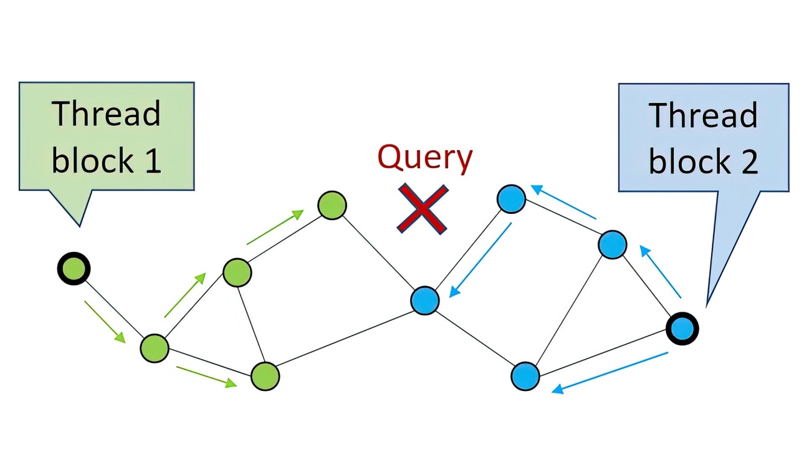

## 什么是向量数据库
向量数据库是一种组织有序的embedding vector集合，整合了可以随时创建、读取、更新和删除的embedding vector。embedding vector将数据块（例如文本或图像）表示为数值。

## 什么是embedding模型
embedding模型会将各种数据（例如文本、图像、图表和视频）转换为数值向量，以便捕捉其在多维向量空间中的含义和细微差别。embedding技术的选择取决于应用需求，同时要兼顾语义深度、计算效率、要编码的数据的类型、维度等因素。

通过将向量映射到多维空间，可以对向量的语义相似性进行细致的分析，从而显著提高搜索和数据分类的准确性。在使用 AI 聊天机器人、大语言模型 (LLM)、检索增强生成 (RAG) 和向量数据库的 AI 应用中以及在搜索引擎和许多其他用例中，embedding模型发挥着至关重要的作用。

## embedding模型如何与向量数据库搭配使用
提取私有企业数据后，系统会将这些数据分块，创建一个向量来表示它们，并将数据块及其对应的向量同可选的元数据一起存储在向量数据库中，以供日后检索。

在收到用户、聊天机器人或 AI 应用发来的查询后，系统会对其进行解析，并使用嵌入模型来获取代表提示的各个部分的embedding vector。然后，使用提示的向量在向量数据库中执行语义搜索，以找到确切匹配或相似度排名前 K 位的向量及其相应的数据块，这些数据块会被放入到提示的上下文中，然后被发送给 LLM。

LangChain 和 LlamaIndex 都是热门的开源框架，支持创建 AI 聊天机器人和 LLM 解决方案。热门的 LLM 包括 OpenAI GPT 和 Meta LlaMA。热门的向量数据库包括 Pinecone 和 Milvus 等。两大热门编程语言是 Python 和 TypeScript。

## 向量数据库中的相似性搜索是什么？
相似性搜索 (也称为向量搜索、向量相似性搜索或语义搜索) 是指人工智能应用程序根据指定的相似性度量标准，从数据库中高效地检索与给定查询的向量嵌入在语义上相似的向量的过程：

* 欧几里得距离：测量各点之间的直接距离。这对于总体差异至关重要的密集特征集的聚类或分类非常有用。
* 余弦相似度：关注向量之间的角度。非常适合文本处理和信息检索，根据方向 (而非传统的距离) 捕获语义相似性。
* 曼哈顿距离：计算笛卡尔坐标中的绝对差值之和。适用于类网格结构中的路由选择和优化问题。这对于稀疏数据很有用。

相似性衡量指标有助于在 AI 聊天机器人、推荐系统和文档检索中高效检索相关项目。它们利用数据中的语义关系来指导生成式 AI 过程并执行自然语言处理 (NLP)，从而增强用户体验。

## 向量搜索中的聚类算法是指什么？
聚类算法可根据共同特征将向量组织成内聚群组，从而促进向量数据库内的模式识别和异常检测。

此过程不仅可以减少数据集大小，从而为数据压缩提供帮助，还能揭示潜在的模式，提供各个领域的宝贵见解。 

K-Means：根据质心接近度将数据划分为 K 个聚类。这种算法对于大型数据集很有效。需要预定义的聚类数量。
DBSCAN 和 HDBSCAN：根据密度形成聚类，区分离群值。能适应复杂形状，不需要指定聚类数量。
分层聚类：通过聚集合并或拆分数据点来创建聚类树。适用于分层数据可视化。
谱聚类：利用相似矩阵特征值实现降维。对于非线性可分离数据非常有效。
均值漂移：通过寻找密度函数最大值来识别聚类。能够灵活适应聚类形状和大小。不需要预先定义聚类数量。
算法方法的多样性适应了不同的数据类型和聚类目标，凸显了在 RAG 架构中从向量数据中提取有意义信息时，聚类方法的多样性和关键重要性。

## 在向量数据库中，索引的作用是什么？
在向量数据库中，索引对于提升高维度数据空间内搜索操作的效率和速度至关重要。考虑到向量数据库中存储的数据的复杂性和数量，索引机制对于快速定位和检索与查询相关性最高的向量至关重要。下面详细解析了向量数据库中索引的主要功能和优势：

* 高效的搜索操作：索引结构 (例如 K-D 树、VP 树或倒排索引) 以特定方式组织数据，能够减少对整个数据集执行详尽搜索的需要，从而实现更快的搜索操作。
* 可扩展性：随着数据量的增长，索引可确保搜索操作能随着数据库的大小有效扩展，从而帮助维持性能水平。
* 减少延迟：通过促进更快的搜索，索引可以显著减少执行查询与获得相应结果之间的延迟，对于需要实时或近实时响应的应用意义非凡。
* 支持复杂查询：高级索引技术可有效地在高维空间中导航，因此可以支持更复杂的查询，包括最近邻点搜索、范围查询和相似性搜索。
* 优化资源使用：有效的索引可以更大限度地减少搜索所需的计算资源，从而节省成本并提高系统可持续性，在基于云的环境或分布式环境中尤为明显。

总之，索引对于向量数据库的性能和功能至关重要，使其能够快速、有效地管理和搜索大量高度复杂的高维数据。这项功能对于各种应用都有着至关重要的意义，从推荐系统、个性化引擎，到 AI 赋能的分析和内容检索系统，皆包括其中。RAPIDS cuVS 提供 GPU 加速，可以将索引构建时间从数天缩短到几小时。

## 向量数据库中的查询处理是什么？
向量数据库的查询处理器与传统关系数据库所使用的体系架构有着根本的不同。在向量数据库中，查询处理的效率和精确度取决于解析、优化和执行查询等复杂的步骤。

处理复杂操作 (如最近邻点识别和相似性搜索) 需要使用高级索引结构和并行处理算法 (例如 cuVS 中的 CAGRA)，从而进一步增强系统有效管理大规模数据的能力。

这种综合全面的方法可确保向量数据库及时、准确地响应用户查询，从而实现信息检索的快速响应和高准确度。系统会处理用户查询以获取其嵌入，然后使用其有效地查询向量数据库，以获得语义相似的嵌入 (向量)。

 

## 哪些因素会影响向量数据库的可扩展性？
向量数据库中的 GPU 加速非常重要，有助于处理不断增加的数据量和计算需求，而且不影响性能。它在 API 背后利用两种主要扩展策略，确保这些数据库能够适应 AI 和大数据分析中日益增长的复杂性：

垂直扩展通过升级计算资源来提升容量，从而在同一台机器内支持更大的数据集和更复杂的操作。水平扩展将数据和工作负载分布到多台服务器上，使系统能够管理更大的请求量，并确保在需求不断变化波动的情况下保持高可用性。

优化算法和并行处理 (尤其是借助 GPU) 是实现高效可扩展性的关键。这些方法可以简化数据处理和检索任务，从而更大限度地降低系统负载。GPU 因并行处理能力而尤为有价值，它可以加速数据密集型计算，并使数据库在跨节点扩展时保持出色的性能水平。

## 向量数据库中的数据规范化是什么？
在向量数据库中，数据规范化涉及到将向量调整到统一的标度，这是确保基于距离的运算 (例如聚类或最近邻点搜索) 实现一致性能的关键步骤。实现这种规范化的常用技术如下：

最小-最大标度会调整数据值，确保其落入指定范围内，通常为 0 到 1 或 -1 到 1。
Z 分数规范化使数据以平均值为中心，标准差为 1。
这些方法对于确保不同来源或维度的数据具有可比较性至关重要，能够提高对数据执行的分析的准确性和可靠性。在机器学习应用中，这种规范化过程尤其重要，有助于消除由特征标度变化而引起的偏置，从而显著提高模型的预测性能。

通过确保所有数据点都按照一致的标度进行评估，数据规范化有助于提高向量数据库中存储的数据的质量，进而帮助获得更有效、更有洞察力的机器学习结果。

## 散列在向量数据库中是如何使用的？
散列是保持向量数据库正常工作的一个基本概念。它将高维数据转换为简化的固定大小格式，优化向量数据库内的向量索引和检索过程。局部敏感散列 (LSH) 等技术对于高效的近似最近邻点搜索特别有价值，可以降低计算复杂度，并加快查询处理速度。在管理大规模高维度空间、确保高效的数据访问以及支持广泛的机器学习和相似性检测任务方面，散列发挥着至关重要的作用。

## 向量数据库中的降噪是什么？
降噪技术旨在尽可能减少向量数据库中不相关或冗余的信息，提高数据的明确度和相关性。特征选择和离群值检测策略有助于优化数据集，提高聚类、相似性搜索和模式识别任务的有效性。保持数据完整性和降噪对于确保基于向量数据库获得的分析和洞见的准确性至关重要。

## 向量数据库中的查询扩展是如何运作的？
向量数据库中的查询扩展可将额外的相关术语整合到查询之中，这能增强搜索查询的有效性，从而扩大搜索范围，以实现更全面的数据检索。这种技术会调整查询向量，以捕获更广泛的语义相似性，从而更紧密地与用户意图保持一致，并实现更彻底的文档检索。这让查询扩展能显著提高搜索结果的精确度和范围，因此是在向量数据库中更高效、有效地发现信息的关键策略。

 

## 在向量数据库中如何实现数据可视化？
在向量数据库中，数据可视化非常重要，它能将高维度数据转换为易于理解的视觉效果，从而辅助分析和决策。以下技术对于复杂数据降维和揭示隐藏在复杂数据中的模式至关重要：

主成分分析 (PCA)
t-分布随机邻域嵌入 (t-SNE)
统一流形逼近与投影 (UMAP)
此过程对于发现原始数据中不明显的宝贵见解、更清晰地传达复杂的数据模式以及促进战略性的数据驱动决策至关重要。
