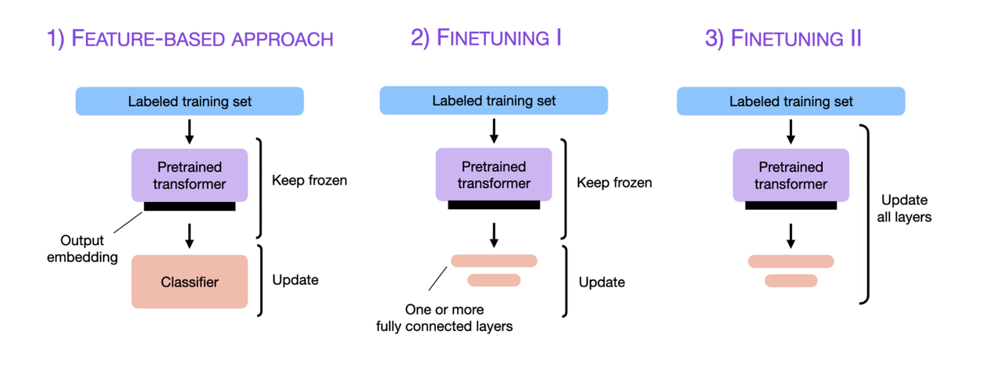
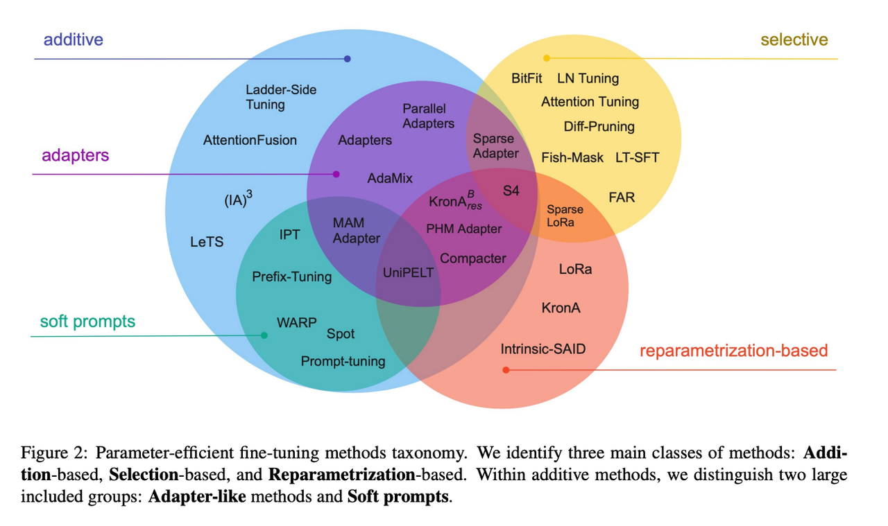
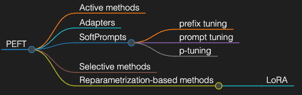

## 传统微调技术

基于预训练模型，在小数据集上微调全量(或少量)参数以适应

In deep learning, fine-tuning is an approach to transfer learning in which the parameters of a pre-trained neural network model are trained on new data.[1] Fine-tuning can be done on the entire neural network, or on only a subset of its layers, in which case the layers that are not being fine-tuned are "frozen" (i.e., not changed during backpropagation).[2] A model may also be augmented with "adapters" that consist of far fewer parameters than the original model, and fine-tuned in a parameter-efficient way by tuning the weights of the adapters and leaving the rest of the model's weights frozen.[3]

For some architectures, such as convolutional neural networks, it is common to keep the earlier layers (those closest to the input layer) frozen, as they capture lower-level features, while later layers often discern high-level features that can be more related to the task that the model is trained on.[2][4]

Models that are pre-trained on large, general corpora are usually fine-tuned by reusing their parameters as a starting point and adding a task-specific layer trained from scratch.[5] Fine-tuning the full model is also common and often yields better results, but is more computationally expensive.[6]

Fine-tuning is typically accomplished via supervised learning, but there are also techniques to fine-tune a model using weak supervision.[7] Fine-tuning can be combined with a reinforcement learning from human feedback-based objective to produce language models such as ChatGPT (a fine-tuned version of GPT models) and Sparrow.[8][9]

## 参数高效微调
Scaling Down to Scale Up: A Guide to Parameter-Efficient Fine-Tuning
传统微调方法在 LLM 上仍然计算量过大，一些较新的微调方法试图保证效果的同时减少训练参数量
轻量化微调，或称为参数高效微调

下面介绍几种主流 LLM 参数高效微调方法

### Adapter Tuning
Parameter-Efficient Transfer Learning for NLP
本文提出的背景和动机是对 Bert 进行参数高效微调，减少微调的参数量；
微调占总参数量的3%

### Prefix Tuning
Prefix-Tuning: Optimizing Continuous Prompts for Generation
本文提出的背景和动机是微调 GPT-2 与 Bert 做文本生成任务 table2text 及 summarization；
微调参数量0.1-2%

### Prompt Tuning
The Power of Scale for Parameter-Efficient Prompt Tuning
本文提出的背景和目标是，随着模型规模增加(LLM)，可以对 prefix tuning 进行简化。只在输入层加入prompt tokens，并不需要加入MLP进行调整来解决难训练的问题，主要在T5预训练模型上做实验；
微调参数量 0.01%

### P-Tuning v1
本文提出的背景和动机是传统认为 GPT 擅长文本生成，而文本理解不如 Bert，通过 prompts 微调 GPT-2 使其具有 sota 的文本理解能力；
微调参数量 0.01%
只在输入层添加 virtual tokens，位置也不一定是前缀，插入位置是可选的

### P-Tuning v2
P-Tuning v2: Prompt Tuning Can Be Comparable to Fine-tuning Universally Across Scales and Tasks
本文提出的背景和动机是 P-Tuning 缺乏通用性(中小模型等)和任务普遍性(序列标注等)，借鉴和优化 Deep Prompt tuning 方法，在更深层结构中引入 virtual tokens；
微调参数量由 v1 的0.01% 增加到 0.1-3%(数量->效果)

每一层都加入了Prompts tokens作为输入，而不是仅仅加在输入层，此外 prompt encoder 可选去掉，prompt length 调优与任务相关

### LoRA
LORA: LOW-RANK ADAPTATION OF LARGE LANGUAGE MODELS
本文提出的背景和动机是 Adapter 方法有推理延迟问题，于是串联改为并联，另外参数 w 矩阵有内在低秩的性质， 可以利用低秩矩阵微调改变参数
微调参数量 0.1-1%，rank 2,4,8

在原始PLM旁边增加一个旁路，做一个降维再升维的操作，来模拟所谓的 intrinsic rank 。训练的时候固定PLM的参数，只训练降维矩阵A与升维矩阵B。而模型的输入输出维度不变，输出时将BA与PLM的参数叠加。用随机高斯分布初始化A，用0矩阵初始化B，保证训练的开始此旁路矩阵依然是0矩阵。

### 总结
目前 LLM 最主流的微调方式是 Adapter, Prompt tuning 和 LoRA
|  微调方式   | Adapter  |  Prompt tuning   | LoRA  |
|  ----  | ----  |  ----  | ----  |
| 模型结构  | 模型串联 MLP | 序列加前缀 virtal token  | 旁路低秩矩阵 |
| 施加层  | 中间层或者输出 | 输入层，或中间层输入  | 中间注意力层 |
| 重参数化  | 是 | 可选  | 是 |
| 微调参数量  | 3% | 0.01%, 0.1-3%  | 0.1%-1% |
| 训练难度  | 较易训练 | 稍难训练  | 较易训练 |
| 推理时参数量  | 加载额外参数 | 加载额外参数  | 参数合并，总参数量不变 |
| 推理延时  | 有延迟，计算量增加 | 无延迟，计算量增加  | 无延迟，计算量不增加 |

## 代码实践
### P-Tuning
https://github.com/THUDM/P-tuning
https://github.com/THUDM/P-tuning-v2

### LoRA
https://github.com/microsoft/LoRA